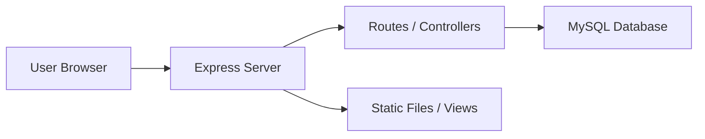
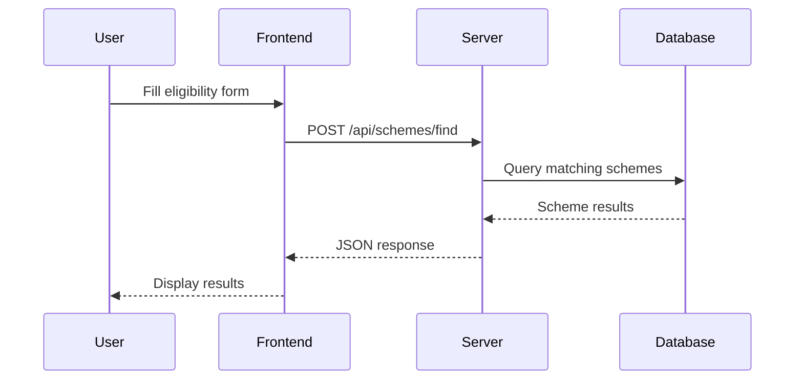
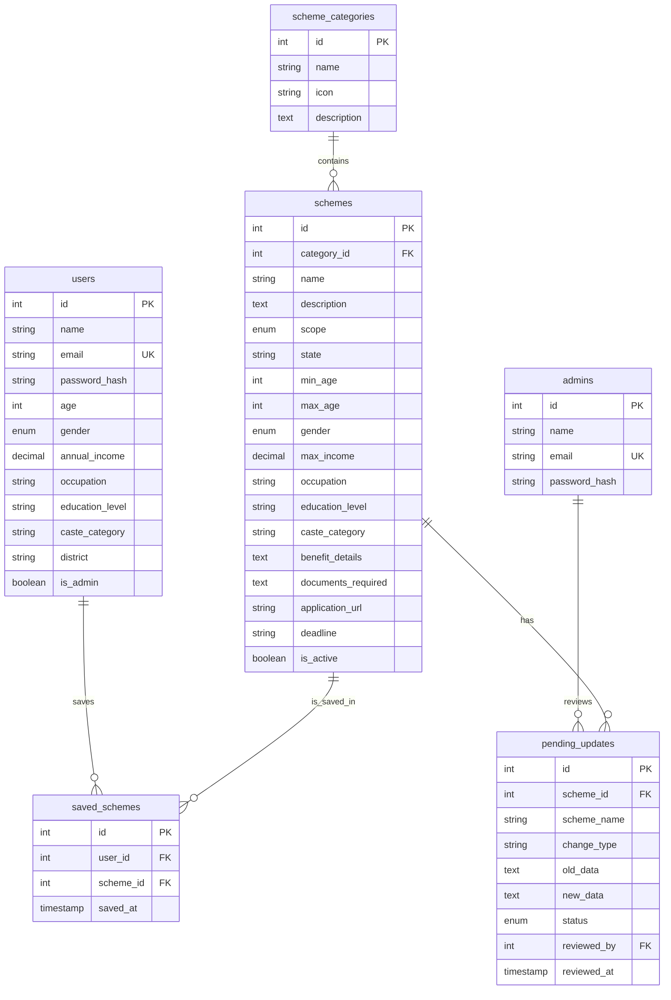
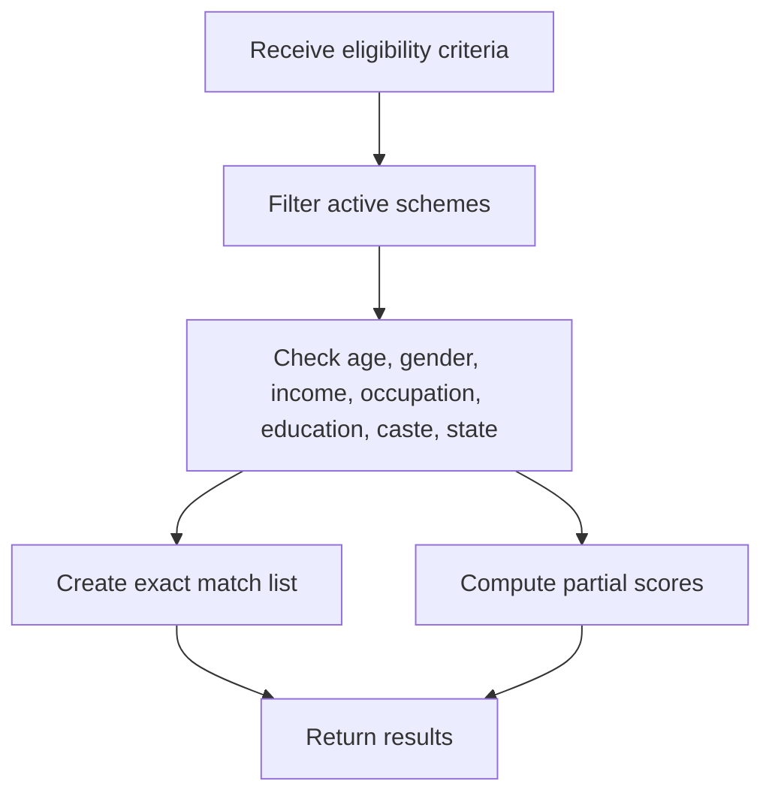
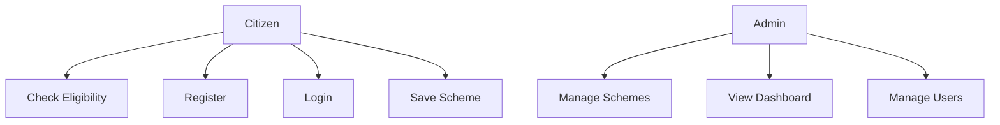
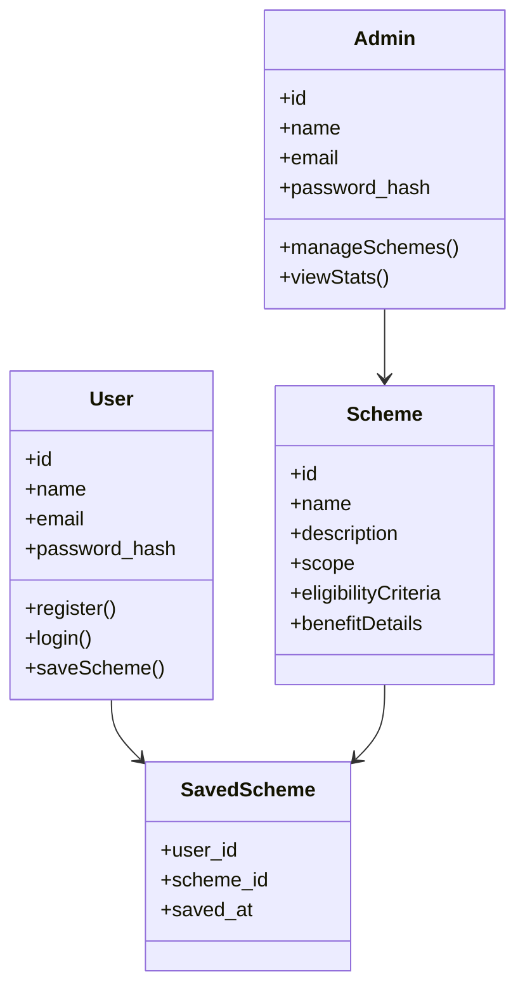
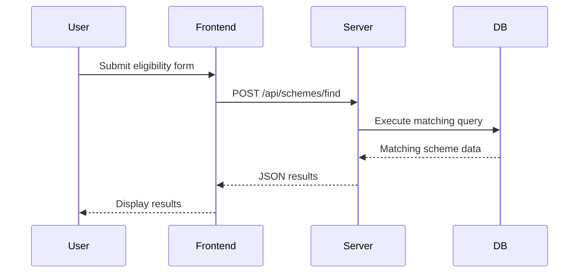
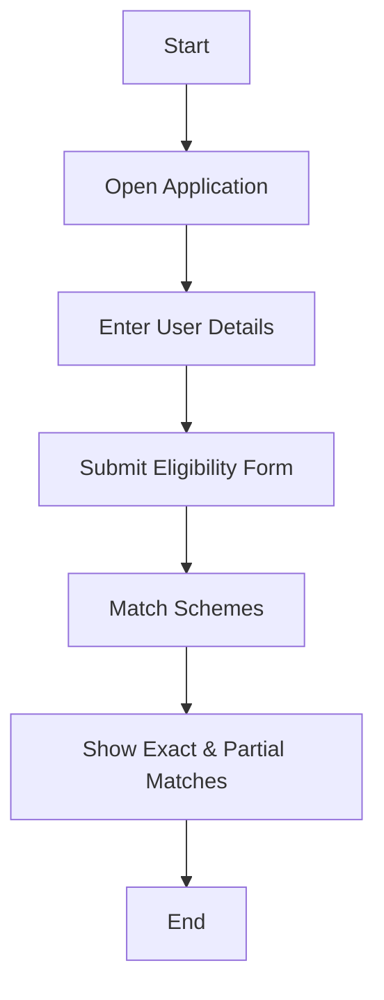

# SchemeSeeker

## Project Documentation

> This document has been prepared from the source code and database schema available in the repository as of 2026-07-21. Any project-specific details not explicitly present in the codebase are marked as “To be provided by the project owner.”

---

# 1. Cover Page

- Project Name: SchemeSeeker
- Version: 1.0.0
- Author: SchemeSeeker Team
- Organization: To be provided by the project owner
- Date: 2026-07-21
- Project Type: Web Application
- Purpose: Help citizens of West Bengal discover government welfare schemes and check eligibility

---

# 2. Table of Contents

1. Cover Page
2. Table of Contents
3. Executive Summary
4. Project Overview
5. System Requirements
6. Technology Stack
7. System Architecture
8. Folder Structure
9. Database Design
10. API Documentation
11. Authentication & Authorization
12. Modules
13. Algorithms
14. UML Diagrams
15. Installation Guide
16. Configuration Guide
17. User Manual
18. Admin Manual
19. Testing
20. Security Considerations
21. Performance Optimization
22. Error Handling
23. Deployment Guide
24. Maintenance Guide
25. Limitations
26. Future Enhancements
27. Frequently Asked Questions (FAQ)
28. Glossary
29. References
30. Appendix

---

# 3. Executive Summary

SchemeSeeker is a web-based eligibility finder for government welfare schemes in India, with a strong focus on West Bengal citizens. The application allows users to enter personal information such as age, gender, income, occupation, education, caste, and state, then compares this data against a database of government schemes to identify relevant matches. The system also supports user registration, saved schemes, and admin management features.

The project is implemented using Node.js and Express.js on the server side, MySQL for persistence, and a responsive HTML/CSS/JavaScript frontend. Its primary goal is to simplify access to welfare-program information and reduce the challenge of manually identifying schemes that a citizen may qualify for.

---

# 4. Project Overview

## 4.1 Background

Many citizens are unaware of the government schemes they are eligible for, especially when schemes vary by age, income, gender, occupation, education, caste, and state. SchemeSeeker addresses this need by providing a searchable, structured, and easy-to-use eligibility matching platform.

## 4.2 Problem Statement

The main problems addressed by this project are:

- Difficulty in identifying relevant government schemes manually
- Lack of a centralized eligibility checker
- Limited digital access to scheme details for citizens
- Limited administrative support for updating and monitoring scheme information

## 4.3 Objectives

The primary objectives of SchemeSeeker are to:

- Provide a simple interface for citizens to check scheme eligibility
- Match user profiles against a curated database of schemes
- Display scheme benefits, requirements, and application links
- Allow users to save relevant schemes for future reference
- Provide an admin panel for scheme and user management

## 4.4 Scope

The current scope includes:

- Scheme browsing and filtering
- Eligibility-based matching for central and state schemes
- User registration and login
- Saved schemes management
- Admin dashboard and basic content management

## 4.5 Features

- Eligibility checker for 45+ schemes
- Browsing by category and scope
- Search by keyword
- Exact and partial match results
- Responsive UI with English and Bengali translations
- User authentication and session-based access
- Admin statistics dashboard
- Saved schemes list

## 4.6 Benefits

- Reduces time spent manually searching for schemes
- Increases scheme awareness among citizens
- Supports targeted welfare outreach
- Enables easy future expansion of the database

---

# 5. System Requirements

## 5.1 Hardware Requirements

- Minimum 2 GB RAM
- 2-core CPU
- 10 GB available storage
- Stable internet connection for external application links

## 5.2 Software Requirements

- Node.js 14 or higher
- MySQL 5.7 or higher
- Modern browser such as Chrome, Firefox, Edge, or Safari

## 5.3 Browser Support

- Chrome 90+
- Firefox 88+
- Edge 90+
- Safari 14+

## 5.4 Dependencies

- express
- express-session
- bcryptjs
- dotenv
- mysql2
- nodemon (development)

---

# 6. Technology Stack

| Layer | Technology | Purpose | Reason for Use |
|---|---|---|---|
| Frontend | HTML5, CSS3, JavaScript | UI and interaction | Lightweight and easy to deploy |
| Framework | Express.js | Backend web server | Simple REST API development |
| Runtime | Node.js | Application execution | Fast, scalable, and widely used |
| Database | MySQL | Persistent storage | Reliable relational data management |
| Database Driver | mysql2 | MySQL connectivity | Strong support for async/await patterns |
| Authentication | bcryptjs, express-session | Password hashing and session handling | Secure and straightforward implementation |
| Environment Config | dotenv | Environment variables | Keeps configuration separate from code |
| Development Tool | nodemon | Auto-restart during development | Improves developer productivity |

---

# 7. System Architecture

## 7.1 High-Level Architecture

The system follows a three-tier architecture:

1. Client Layer
   - Web browser rendering HTML pages and JavaScript logic
2. Application Layer
   - Express.js server handling routes, authentication, and business logic
3. Data Layer
   - MySQL database storing schemes, categories, users, saved schemes, and admin accounts



## 7.2 Component Architecture

- Public frontend assets in the public directory
- Route handlers organized by responsibility in routes/
- Authentication rules in middleware/
- Database connection in config/

## 7.3 Data Flow

1. User submits eligibility criteria through the form.
2. The frontend sends the data to /api/schemes/find.
3. The server builds a dynamic SQL query.
4. Matching schemes are returned to the client.
5. The client displays exact and partial matches.

## 7.4 Client-Server Interaction

- The frontend uses fetch API to communicate with backend endpoints.
- Stateless session management is used for login and admin access.
- Server responses are JSON for API routes and HTML pages for navigation routes.

## 7.5 Request Lifecycle



---

# 8. Folder Structure

```text
webdev/
  config/
    db.js
  docs/
    PROJECT_DOCUMENTATION.md
  middleware/
    auth.js
  public/
    css/
      style.css
    js/
      main.js
  routes/
    admin.js
    schemes.js
    users.js
  views/
    index.html
    form.html
    results.html
    scheme-detail.html
    login.html
    register.html
    admin/
      dashboard.html
      login.html
  .env
  database.sql
  package.json
  server.js
```

## Explanation of Major Files

- config/db.js: Creates and exports the MySQL connection pool.
- middleware/auth.js: Defines authentication middleware for users and admins.
- routes/schemes.js: Handles scheme listing, detail retrieval, category browsing, and eligibility matching.
- routes/users.js: Handles user registration, login, profile, saved schemes, and logout.
- routes/admin.js: Handles admin login, setup, dashboard statistics, and scheme/user management.
- public/js/main.js: Implements client-side page behavior and API calls.
- public/css/style.css: Contains site styling and responsive design logic.
- views/: Contains HTML templates for the app pages.
- database.sql: Complete database schema and sample seed data.
- server.js: Starts the Express server and mounts routes.

---

# 9. Database Design

## 9.1 ER Diagram



## 9.2 Tables

| Table | Purpose |
|---|---|
| scheme_categories | Stores scheme categories such as Farmers, Women, Students, Health, Housing |
| schemes | Stores all scheme records and eligibility criteria |
| users | Stores registered user profiles |
| saved_schemes | Links users to their saved schemes |
| admins | Stores admin credentials |
| pending_updates | Stores change requests or pending scheme updates |

## 9.3 Relationships

- Each scheme belongs to one category.
- Users can save many schemes.
- A scheme can be saved by many users.
- Admins can review pending updates.

## 9.4 Constraints

- Foreign keys enforce relational integrity.
- Email fields are unique.
- saved_schemes uses a unique composite key to prevent duplicate saves.

## 9.5 Indexes

- Primary keys on each table
- Unique key on users.email
- Unique key on admins.email
- Unique key on saved_schemes(user_id, scheme_id)

## 9.6 Data Dictionary

| Column | Type | Description |
|---|---|---|
| schemes.name | VARCHAR(200) | Scheme title |
| schemes.scope | ENUM | central or state |
| schemes.min_age / max_age | INT | Eligibility age range |
| schemes.gender | ENUM | male, female, or all |
| schemes.max_income | DECIMAL | Maximum income threshold |
| schemes.occupation | VARCHAR(100) | Occupation requirement |
| schemes.education_level | VARCHAR(100) | Education requirement |
| schemes.caste_category | VARCHAR(50) | Caste or category filter |
| schemes.benefit_details | TEXT | Benefit description |
| schemes.documents_required | TEXT | Required documents |
| users.email | VARCHAR(100) | Login identifier |
| saved_schemes.saved_at | TIMESTAMP | Time when the scheme was saved |

---

# 10. API Documentation

## 10.1 Health and Session Endpoints

### GET /api/health
- Method: GET
- Parameters: None
- Headers: None
- Authentication: None
- Request Example: `curl http://localhost:3000/api/health`
- Response Example:
```json
{
  "status": "OK",
  "message": "SchemeSeeker API is running"
}
```
- Error Codes: 500

### GET /api/session
- Method: GET
- Parameters: None
- Headers: None
- Authentication: None
- Request Example: `curl http://localhost:3000/api/session`
- Response Example:
```json
{
  "loggedIn": false
}
```
- Error Codes: 500

## 10.2 Scheme Endpoints

### GET /api/schemes/categories/all
- Method: GET
- Parameters: None
- Headers: `Accept: application/json`
- Authentication: None
- Request Example:
```bash
curl http://localhost:3000/api/schemes/categories/all
```
- Response Example:
```json
{
  "success": true,
  "categories": [
    {
      "id": 1,
      "name": "Farmers",
      "icon": "bi bi-flower1"
    }
  ]
}
```
- Error Codes: 500

### GET /api/schemes
- Method: GET
- Parameters: `category`, `scope`, `search`, `page`, `limit`
- Headers: `Accept: application/json`
- Authentication: None
- Request Example:
```bash
curl "http://localhost:3000/api/schemes?category=1&scope=state&limit=10"
```
- Response Example:
```json
{
  "success": true,
  "schemes": [],
  "pagination": {
    "page": 1,
    "limit": 10,
    "total": 0,
    "pages": 0
  }
}
```
- Error Codes: 500

### GET /api/schemes/:id
- Method: GET
- Parameters: `id` (path parameter)
- Headers: `Accept: application/json`
- Authentication: None
- Request Example:
```bash
curl http://localhost:3000/api/schemes/1
```
- Response Example:
```json
{
  "success": true,
  "scheme": {
    "id": 1,
    "name": "PM-KISAN (Pradhan Mantri Kisan Samman Nidhi)"
  }
}
```
- Error Codes: 404, 500

### POST /api/schemes/find
- Method: POST
- Parameters: `age`, `gender`, `income`, `occupation`, `education`, `caste`, `state`
- Headers: `Content-Type: application/json`
- Authentication: None
- Request Example:
```bash
curl -X POST http://localhost:3000/api/schemes/find \
  -H "Content-Type: application/json" \
  -d '{"age": 30,"gender":"male","income":200000,"occupation":"farmer","education":"12th","caste":"general","state":"west bengal"}'
```
- Response Example:
```json
{
  "success": true,
  "exactMatches": [],
  "partialMatches": [],
  "totalMatches": 0,
  "totalPartial": 0
}
```
- Error Codes: 500

### GET /api/schemes/:id/related
- Method: GET
- Parameters: `id` (path parameter)
- Headers: `Accept: application/json`
- Authentication: None
- Request Example:
```bash
curl http://localhost:3000/api/schemes/1/related
```
- Response Example:
```json
{
  "success": true,
  "related": []
}
```
- Error Codes: 404, 500

## 10.3 User Endpoints

### POST /api/users/register
- Method: POST
- Parameters: `name`, `email`, `password`, `age`, `gender`, `annual_income`, `occupation`, `education_level`, `caste_category`, `district`
- Headers: `Content-Type: application/json`
- Authentication: None
- Request Example:
```bash
curl -X POST http://localhost:3000/api/users/register \
  -H "Content-Type: application/json" \
  -d '{"name":"Asha","email":"asha@example.com","password":"secret123"}'
```
- Response Example:
```json
{
  "success": true,
  "message": "Registration successful",
  "user": {
    "id": 1,
    "name": "Asha",
    "email": "asha@example.com"
  }
}
```
- Error Codes: 400, 409, 500

### POST /api/users/login
- Method: POST
- Parameters: `email`, `password`
- Headers: `Content-Type: application/json`
- Authentication: None
- Request Example:
```bash
curl -X POST http://localhost:3000/api/users/login \
  -H "Content-Type: application/json" \
  -d '{"email":"asha@example.com","password":"secret123"}'
```
- Response Example:
```json
{
  "success": true,
  "message": "Login successful",
  "user": {
    "id": 1,
    "name": "Asha",
    "email": "asha@example.com"
  }
}
```
- Error Codes: 400, 401, 500

### POST /api/users/logout
- Method: POST
- Parameters: None
- Headers: `Content-Type: application/json`
- Authentication: Session-based
- Request Example:
```bash
curl -X POST http://localhost:3000/api/users/logout
```
- Response Example:
```json
{
  "success": true,
  "message": "Logged out successfully"
}
```
- Error Codes: 500

### GET /api/users/profile
- Method: GET
- Parameters: None
- Headers: `Accept: application/json`
- Authentication: Required (session user)
- Request Example:
```bash
curl http://localhost:3000/api/users/profile
```
- Response Example:
```json
{
  "success": true,
  "user": {
    "id": 1,
    "name": "Asha",
    "email": "asha@example.com"
  }
}
```
- Error Codes: 401, 404, 500

### PUT /api/users/profile
- Method: PUT
- Parameters: `name`, `age`, `gender`, `annual_income`, `occupation`, `education_level`, `caste_category`, `district`
- Headers: `Content-Type: application/json`
- Authentication: Required (session user)
- Request Example:
```bash
curl -X PUT http://localhost:3000/api/users/profile \
  -H "Content-Type: application/json" \
  -d '{"name":"Asha","age":31}'
```
- Response Example:
```json
{
  "success": true,
  "message": "Profile updated successfully"
}
```
- Error Codes: 401, 500

### GET /api/users/saved-schemes
- Method: GET
- Parameters: None
- Headers: `Accept: application/json`
- Authentication: Required (session user)
- Request Example:
```bash
curl http://localhost:3000/api/users/saved-schemes
```
- Response Example:
```json
{
  "success": true,
  "savedSchemes": []
}
```
- Error Codes: 401, 500

### POST /api/users/save-scheme
- Method: POST
- Parameters: `scheme_id`
- Headers: `Content-Type: application/json`
- Authentication: Required (session user)
- Request Example:
```bash
curl -X POST http://localhost:3000/api/users/save-scheme \
  -H "Content-Type: application/json" \
  -d '{"scheme_id": 1}'
```
- Response Example:
```json
{
  "success": true,
  "message": "Scheme saved successfully"
}
```
- Error Codes: 400, 401, 500

### DELETE /api/users/save-scheme/:id
- Method: DELETE
- Parameters: `id` (path parameter)
- Headers: `Accept: application/json`
- Authentication: Required (session user)
- Request Example:
```bash
curl -X DELETE http://localhost:3000/api/users/save-scheme/1
```
- Response Example:
```json
{
  "success": true,
  "message": "Scheme removed from saved list"
}
```
- Error Codes: 401, 500

## 10.4 Admin Endpoints

### POST /api/admin/login
- Method: POST
- Parameters: `email`, `password`
- Headers: `Content-Type: application/json`
- Authentication: None
- Request Example:
```bash
curl -X POST http://localhost:3000/api/admin/login \
  -H "Content-Type: application/json" \
  -d '{"email":"admin@schemeseeker.in","password":"admin123"}'
```
- Response Example:
```json
{
  "success": true,
  "message": "Admin login successful"
}
```
- Error Codes: 400, 401, 500

### POST /api/admin/logout
- Method: POST
- Parameters: None
- Headers: `Content-Type: application/json`
- Authentication: Session-based admin
- Request Example:
```bash
curl -X POST http://localhost:3000/api/admin/logout
```
- Response Example:
```json
{
  "success": true,
  "message": "Logged out successfully"
}
```
- Error Codes: 500

### POST /api/admin/setup
- Method: POST
- Parameters: `name`, `email`, `password`
- Headers: `Content-Type: application/json`
- Authentication: None
- Request Example:
```bash
curl -X POST http://localhost:3000/api/admin/setup \
  -H "Content-Type: application/json" \
  -d '{"name":"Admin","email":"admin@example.com","password":"securepass"}'
```
- Response Example:
```json
{
  "success": true,
  "message": "Admin created successfully"
}
```
- Error Codes: 400, 403, 500

### GET /api/admin/stats
- Method: GET
- Parameters: None
- Headers: `Accept: application/json`
- Authentication: Required (admin session)
- Request Example:
```bash
curl http://localhost:3000/api/admin/stats
```
- Response Example:
```json
{
  "success": true,
  "stats": {
    "totalSchemes": 45,
    "activeSchemes": 45,
    "totalUsers": 10
  }
}
```
- Error Codes: 403, 500

### GET /api/admin/schemes
- Method: GET
- Parameters: `page`, `limit`
- Headers: `Accept: application/json`
- Authentication: Required (admin session)
- Request Example:
```bash
curl "http://localhost:3000/api/admin/schemes?page=1&limit=20"
```
- Response Example:
```json
{
  "success": true,
  "schemes": [],
  "pagination": {
    "page": 1,
    "limit": 20,
    "total": 0
  }
}
```
- Error Codes: 403, 500

### POST /api/admin/schemes
- Method: POST
- Parameters: scheme fields such as `name`, `description`, `category_id`, `scope`, `state`, `benefit_details`
- Headers: `Content-Type: application/json`
- Authentication: Required (admin session)
- Request Example:
```bash
curl -X POST http://localhost:3000/api/admin/schemes \
  -H "Content-Type: application/json" \
  -d '{"name":"New Scheme","category_id":1,"description":"Demo","scope":"state","state":"west bengal"}'
```
- Response Example:
```json
{
  "success": true,
  "message": "Scheme created",
  "schemeId": 1
}
```
- Error Codes: 403, 500

### PUT /api/admin/schemes/:id
- Method: PUT
- Parameters: `id` (path parameter) and updated scheme fields
- Headers: `Content-Type: application/json`
- Authentication: Required (admin session)
- Request Example:
```bash
curl -X PUT http://localhost:3000/api/admin/schemes/1 \
  -H "Content-Type: application/json" \
  -d '{"is_active": false}'
```
- Response Example:
```json
{
  "success": true,
  "message": "Scheme updated"
}
```
- Error Codes: 403, 500

### DELETE /api/admin/schemes/:id
- Method: DELETE
- Parameters: `id` (path parameter)
- Headers: `Accept: application/json`
- Authentication: Required (admin session)
- Request Example:
```bash
curl -X DELETE http://localhost:3000/api/admin/schemes/1
```
- Response Example:
```json
{
  "success": true,
  "message": "Scheme deactivated"
}
```
- Error Codes: 403, 500

### GET /api/admin/users
- Method: GET
- Parameters: None
- Headers: `Accept: application/json`
- Authentication: Required (admin session)
- Request Example:
```bash
curl http://localhost:3000/api/admin/users
```
- Response Example:
```json
{
  "success": true,
  "users": []
}
```
- Error Codes: 403, 500

---

# 11. Authentication & Authorization

## 11.1 Login Flow

1. User submits email and password through the login page.
2. The server checks the users table.
3. A bcrypt comparison validates the supplied password.
4. On success, a session is created with `userId` and `userName`.

## 11.2 Registration

Users can register by providing a name, email, password, and optional demographic details. The system hashes the password with bcrypt before storing it.

## 11.3 Password Hashing

Passwords are stored as `password_hash` rather than plaintext. The code uses `bcryptjs` with a cost factor of 10.

## 11.4 Session Management

The application uses `express-session` with a configurable secret stored in `.env`.

## 11.5 Roles

- Regular users
- Admin users

## 11.6 Permissions

- Regular users can view schemes, save schemes, and manage their profile.
- Admin users can view dashboard statistics and manage schemes/users.

---

# 12. Modules

## 12.1 Scheme Discovery Module

- Purpose: Allow users to browse and discover schemes
- Workflow: User submits form data -> backend matches schemes -> results shown
- Business Logic: Eligibility filtering across age, income, gender, occupation, education, caste, and state
- Screens: Home page, Form page, Results page, Scheme detail page
- Dependencies: routes/schemes.js, public/js/main.js, database.sql

## 12.2 User Account Module

- Purpose: Register, log in, manage profile, and save schemes
- Workflow: Register -> login -> session -> profile and save actions
- Business Logic: Password encryption, session persistence, saved-scheme linking
- Screens: Login page, Register page, profile and saved schemes UI
- Dependencies: routes/users.js, middleware/auth.js

## 12.3 Admin Module

- Purpose: Manage schemes and monitor application activity
- Workflow: Admin login -> stats dashboard -> scheme/user management
- Business Logic: Dashboard analytics, CRUD for schemes, user listing
- Screens: Admin login, Admin dashboard
- Dependencies: routes/admin.js, views/admin/*

## 12.4 Frontend Presentation Module

- Purpose: Deliver responsive website pages and language switching
- Workflow: Static assets loaded via Express; JavaScript handles dynamic behavior
- Business Logic: Form submission, results rendering, toast notifications, localization
- Screens: All page views in views/
- Dependencies: public/js/main.js, public/css/style.css

---

# 13. Algorithms

## 13.1 Eligibility Matching Algorithm

The core matching logic is implemented in routes/schemes.js. The server applies strict criteria first, then computes a partial match score for schemes that nearly meet the requirements.

### Pseudocode

```text
INPUT: user profile data

1. Select all active schemes
2. For each scheme, test the following conditions:
   - age is within min_age and max_age range
   - gender matches or is set to all
   - income is within the allowed max_income range
   - occupation matches or is set to all
   - education level matches or is set to all
   - caste category matches or is set to all
   - state matches or is set to all
3. Schemes satisfying all conditions are marked as exact matches
4. Other schemes that satisfy at least 5 of 8 checks are marked as partial matches
5. Return both lists to the client
```

### Flow



## 13.2 Password Hashing

Passwords are hashed using bcrypt before insertion into the database.

---

# 14. UML Diagrams

## 14.1 Use Case Diagram



## 14.2 Class Diagram



## 14.3 Sequence Diagram



## 14.4 Activity Diagram



---

# 15. Installation Guide

## 15.1 Clone Repository

```bash
git clone <repository-url>
cd webdev
```

## 15.2 Install Dependencies

```bash
npm install
```

## 15.3 Environment Variables

Create a `.env` file with values similar to:

```env
DB_HOST=localhost
DB_USER=root
DB_PASSWORD=your_password
DB_NAME=scheme_finder
PORT=3000
SESSION_SECRET=your_secret_key
```

## 15.4 Database Setup

```bash
mysql -u root -p < database.sql
```

## 15.5 Run Locally

Development mode:

```bash
npm run dev
```

Production mode:

```bash
npm start
```

The application will be available at:

```text
http://localhost:3000
```

## 15.6 Create Admin Account

```bash
curl -X POST http://localhost:3000/api/admin/setup \
  -H "Content-Type: application/json" \
  -d '{"name":"Admin","email":"admin@schemeseeker.in","password":"admin123"}'
```

---

# 16. Configuration Guide

## 16.1 Configuration Files

| File | Purpose |
|---|---|
| .env | Stores database and session configuration |
| package.json | Lists dependencies and scripts |
| config/db.js | Defines database connection pool settings |

## 16.2 Environment Variables

| Variable | Description |
|---|---|
| DB_HOST | MySQL host |
| DB_USER | MySQL username |
| DB_PASSWORD | MySQL password |
| DB_NAME | Database name |
| PORT | Port for the Express server |
| SESSION_SECRET | Secret for session encryption |

---

# 17. User Manual

## 17.1 Accessing the Application

Open the home page in a browser and navigate to the eligibility form.

## 17.2 Using the Eligibility Checker

1. Open the form page.
2. Enter personal information.
3. Submit the form.
4. Review exact and partial matches.
5. Select a scheme to view details and official links.

## 17.3 Saving Schemes

Logged-in users may save schemes for later access.

## 17.4 Browsing Schemes

Users can browse available schemes by category or search by keyword.

---

# 18. Admin Manual

## 18.1 Admin Login

Navigate to the admin login page and sign in with admin credentials.

## 18.2 Dashboard Features

- View total schemes
- View active schemes
- View registered users
- Review popular schemes
- Review recent registrations

## 18.3 Scheme Management

Admins may create, update, or deactivate schemes through the admin API endpoints.

## 18.4 User Management

Admins can view all registered users from the dashboard statistics API.

---

# 19. Testing

## 19.1 Test Strategy

The current repository does not include an automated testing suite. The existing script is a placeholder that exits successfully.

## 19.2 Recommended Testing Approach

- Unit tests for validation logic and eligibility matching
- Integration tests for API routes
- Manual UI testing for forms and navigation
- API testing using curl or Postman

## 19.3 Sample Test Cases

| Area | Test Case |
|---|---|
| Registration | User registers with valid credentials |
| Login | User logs in with correct password |
| Failed Login | User logs in with wrong password |
| Scheme Search | Eligibility form returns matching schemes |
| Save Scheme | Logged-in user saves a scheme |
| Admin Login | Admin logs in successfully |

## 19.4 Bug Reporting Process

- Capture the symptoms and steps to reproduce
- Record expected vs actual behavior
- Note browser, OS, and request payload
- Report the issue to the project owner or maintainer

---

# 20. Security Considerations

- Passwords are hashed using bcrypt
- Session-based authentication is used for users and admins
- Input validation is handled in the route handlers
- SQL queries use parameterized statements through mysql2
- Static and dynamic content should be sanitized before rendering in future enhancements
- HTTPS should be enforced in production
- Admin credentials should be changed before deployment

---

# 21. Performance Optimization

- Use pagination for large scheme lists
- Keep the database connection pool healthy
- Avoid unnecessary repeated queries
- Cache frequently requested categories and static content where possible
- Consider adding indexing for frequently searched columns in the future

---

# 22. Error Handling

The server includes a global error middleware and route-level try/catch blocks. Errors are returned as JSON for APIs and rendered gracefully in the frontend UI.

## Recommended Improvements

- Centralized logging
- Structured error codes
- Better handling of database connection failures
- Monitoring tools for server health

---

# 23. Deployment Guide

## 23.1 Production Setup

- Set up a Linux server or cloud instance
- Install Node.js and MySQL
- Configure environment variables securely
- Start the application with a process manager such as PM2

## 23.2 CI/CD

To be provided by the project owner.

## 23.3 Docker

Docker support is not currently included in the repository.

## 23.4 Reverse Proxy

A reverse proxy such as Nginx may be used for HTTPS and traffic routing.

## 23.5 SSL

SSL/TLS should be configured in production.

## 23.6 Domain Configuration

Domain settings are to be provided by the deployment owner.

---

# 24. Maintenance Guide

## 24.1 Backup Strategy

- Regular MySQL database backups
- Keep copies of the application source and environment files

## 24.2 Database Migration

New schema changes should be applied through migration scripts or carefully reviewed SQL updates.

## 24.3 Updates

- Update dependencies regularly
- Review security advisories for Node.js packages

## 24.4 Monitoring

- Check application logs
- Monitor server uptime and database connectivity

## 24.5 Troubleshooting

Common issues include:

- MySQL connection failure
- Incorrect `.env` values
- Missing dependencies
- Port conflicts

---

# 25. Limitations

- The project currently relies on a local or manually configured MySQL instance.
- There is no formal automated test suite.
- Admin functions are basic and not yet role-advanced.
- Production deployment details are not yet defined in the repository.
- The database contains sample and seed data that may need review for production accuracy.

---

# 26. Future Enhancements

- Add role-based administration with finer permission control
- Implement email verification and password reset
- Add a recommendation engine for schemes
- Include multilingual content beyond English and Bengali
- Add export/import support for scheme data
- Improve analytics and reporting
- Add Docker deployment support

---

# 27. Frequently Asked Questions (FAQ)

## Q1. What does SchemeSeeker do?
It helps users find government schemes they may be eligible for based on personal profile data.

## Q2. Does it support only West Bengal?
The application supports both central and West Bengal state schemes.

## Q3. Is user registration required?
No, users can browse schemes without registering, but registration is required to save schemes.

## Q4. Can admins update schemes?
Yes, admin APIs support scheme creation, update, and deactivation.

## Q5. Where is the database stored?
The project uses MySQL and the database is configured through the `.env` file.

---

# 28. Glossary

- Scheme: A government welfare or support program
- Eligibility Matching: Comparing user profile data to the requirements of a scheme
- Exact Match: A scheme that satisfies all key criteria
- Partial Match: A scheme that satisfies most criteria but not all
- Admin: A privileged user who manages content and users

---

# 29. References

- Project source code and database schema in the repository
- Node.js official documentation
- Express.js documentation
- MySQL documentation
- bcrypt documentation

---

# 30. Appendix

## 30.1 Configuration Sample

```env
DB_HOST=localhost
DB_USER=root
DB_PASSWORD=seeker321
DB_NAME=scheme_finder
PORT=3000
SESSION_SECRET=scheme_finder_secret_key_2026_change_in_production
```

## 30.2 Example API Request

```bash
curl -X POST http://localhost:3000/api/schemes/find \
  -H "Content-Type: application/json" \
  -d '{"age": 28,"gender":"female","income":120000,"occupation":"student","education":"12th","caste":"general","state":"west bengal"}'
```

## 30.3 Example API Response

```json
{
  "success": true,
  "exactMatches": [],
  "partialMatches": [],
  "totalMatches": 0,
  "totalPartial": 0
}
```

## 30.4 Sample Database Records

Example scheme record:

```text
Name: PM-KISAN (Pradhan Mantri Kisan Samman Nidhi)
Scope: central
Category: Farmers
Max Age: 120
Occupation: farmer
```

## 30.5 Screenshots Placeholders

- Home Page: To be added
- Eligibility Form: To be added
- Results Page: To be added
- Admin Dashboard: To be added

---

End of Document
